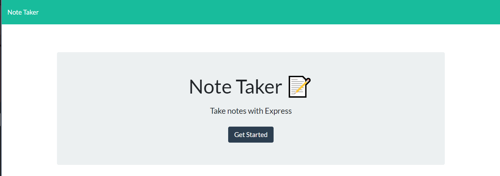
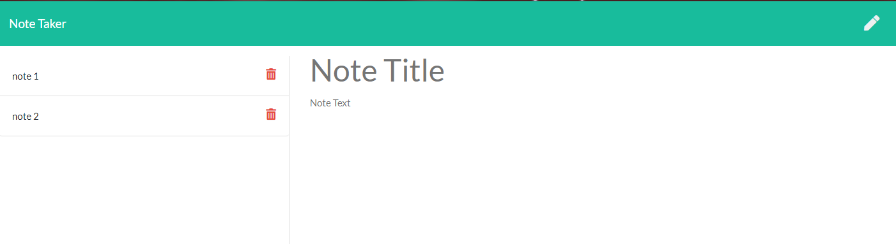

# **hw11-note-taker**
  
  
  
  ## **Description**
  
  An application that can be used to write, save, and delete notes. Utilizes an express backend to save and retrieve note data from a JSON file, and Heroku to host the server.
  <br><br>
  
  ## **Table of Contents**
  
  * [Installation](#Installation)
  * [Usage](#Usage)
  * [License](#License)
  * [Contributing](#Contributing)
  * [Tests](#Tests)
  * [Questions](#Questions)
  
  <br><br>
  
  ## **Installation**
  
  1. Clone the repo
  ```sh
  git clone https://github.com/virlym/hw11-note-taker.git
  ``` 
  2. Install NPM packages
  ```sh
  npm install
  ```
  <br><br>
  
  ## **Usage**
  Write and save notes to a JSON file that can be retrieved for later use.
  
  [Heroku Deployed](https://hw11-note-taker-heroku.herokuapp.com/)

  
  
  
  <br><br>
  
  ## **License**
  
  Distributed under the MIT License.
  <br><br>
  
  ## **Contributing**
  Contributions are what make the open source community such an amazing place to be learn, inspire, and create. Any contributions you make are **greatly appreciated**.
  
  1. Fork the Project
  2. Create your Feature Branch (`git checkout -b feature/AmazingFeature`)
  3. Commit your Changes (`git commit -m 'Add some AmazingFeature'`)
  4. Push to the Branch (`git push origin feature/AmazingFeature`)
  5. Open a Pull Request
  
  <br><br>
  
  ## **Technology**
  - [JavaScript](https://www.javascript.com/)
  - [Express](https://expressjs.com/)
  - [File System](https://nodejs.org/api/fs.html)
  - [Path](https://nodejs.org/api/path.html)

  <br><br>
  
  ## **Questions**
  Learn about more of my work at [my GitHub](https://github.com/virlym)
  
  You can send any additional questions to my email : virlym@gmail.com
  <br><br><br><br>